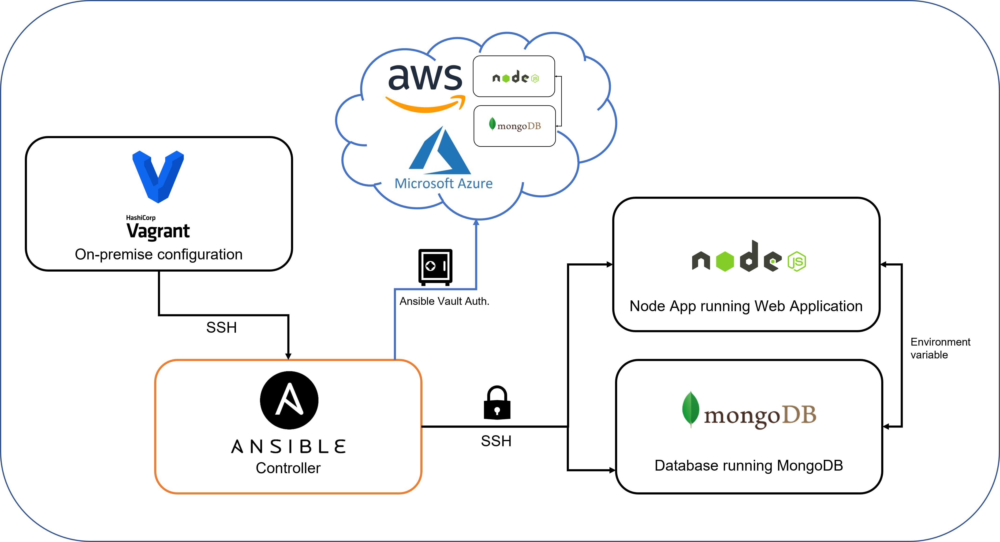
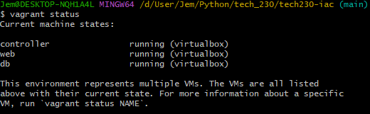
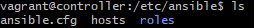
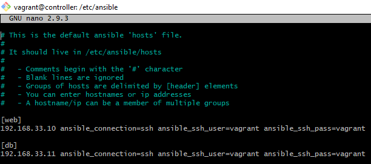
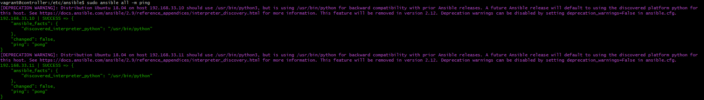
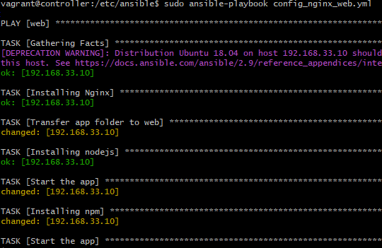
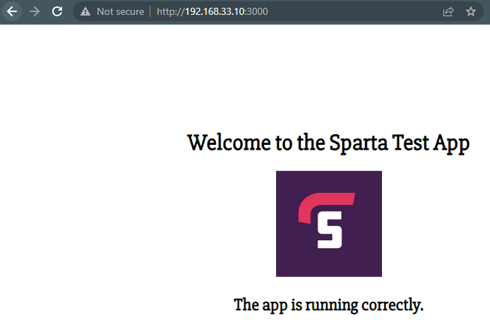

## What Infrastructure as Code (IaC)?

IaC is the managing and provisioning of instrastructure through code instead of manual processes.

IaC has many benefits for businesses including to reduce cost through saving time and resources, eliminate configuration drift and ensure provisioning of stable & scalable environments.

## Why Ansible?

Ansible allows users to quickly and easily deploy multi-tier architecture.

Ansible is agentless and only needs to be installed on the controller (or master node); The systems being controlled do not need to have ansible installed.



## **Section 1**: Using Vagrant to configure an Ansible architecture

In this guide, three virtual machines are configured through vagrant containing the provisions for a controller, web application and database with the following network configuration.

A prerequisite to this guide is to have the application and associated database folder within the same directory as the vagrant file. Ensure to also sync these files so they appear within the controller once vagrant is run.

***controller***: 192.168.33.12

***web***: 192.168.33.10

***db***: 192.168.33.11

> Note: The vagrant file will contain the configuration for the controller, app and db. For this example, ubuntu 18.04 is the OS.

**Step 1**: Run the virtual machine and check that all three virtual machines are running.

```bash
vagrant up

vagrant status
```



**Step 2**: Access each of the virtual machines through SSH and update & upgrade the APT packages.

```bash
vagrant ssh <vm>

sudo apt-get update -y && sudo apt-get upgrade -y

exit
```

**Step 3**: SSH back into the controller and establish its connection to the two virtual machines through ssh, the user will be prompted with a password. 

> Note: Remember to be in the controller before establishing the connection. The password to access these VMs is vagrant.

```bash
ssh vagrant@<vm-ip-address>

exit
```

**Step 4**: Return back to the controller and install ansible.

```bash
sudo apt update -y && sudo apt upgrade -y

sudo apt install software-properties-common

sudo apt-add-repository ppa:ansible/ansible

sudo apt-get update -y

sudo apt install ansible

ansible --version
```

**Step 5**: New configuration files are now available to provision ansible and the controller to the two virtual machines; display the newly created directories and switch to the ansible directory.

```bash
sudo apt install tree

tree

cd /etc/ansible
```



**Step 6**: Access the `hosts` file and provide the required information to access the virtual machines.

```bash
sudo nano hosts
```



**Step 7**: Check to see the connections have been established. `Ping` looks for all the hosts in the agent nodes, inside the posts file and if any found, a ping request is sent.

```bash
sudo ansible all -m ping
```



## **Section 2**: Using Ansible to deploy a running web application

A prerequisite reminder for this section is to have the application folder present in the controller user directory. If not, ensure the file is present in the local vagrant directory and that the vagrant file contains the sync_file command to transfer it to the VM; proceed to destroy and start vagrant again.

**Step 8**: YAML defines its provisioning script as a playbook, containing a set of tasks to be executed. Create this file within the `/etc/ansible` directory.

```bash
sudo nano <playbook-name>.yml
```

**Step 9**: The following sudo code and commands.

```yaml
# create a playbook to install the applications dependencies and run

# add the 3 dashes --- to start the YAML file

---

# add the name of the host
- hosts: web

# gather additional facts about the steps
  gather_facts: yes

# add admins access to this file
  become: true

# add instructions to install + enable nginx - ensure status is running
  tasks:
  - name: Installing Nginx
    apt: pkg=nginx state=present

# add app folder to the web VM
  - name: Transfer app folder to web
    become: true
    synchronize:
      src: ~/app
      dest: /home/vagrant

# add instructions to install nodejs
  - name: Installing nodejs
    apt: pkg=nodejs state=present

# kill all nodejs processes before starting
  - name: Kill all node processes
    shell: killall node
    args:
      chdir: /home/vagrant/app/app

# add instructions to install npm
  - name: Installing npm
    shell: npm install
    args:
      chdir: /home/vagrant/app/app

# start app
  - name: Start the app
    shell: npm start
    args:
      chdir: /home/vagrant/app/app
```

**Step 10**: Execute the playbook to install the app dependencies and run the app. Check the app is running on the web browser.

```bash
sudo ansible-playbook <playbook-name>.yml
```



