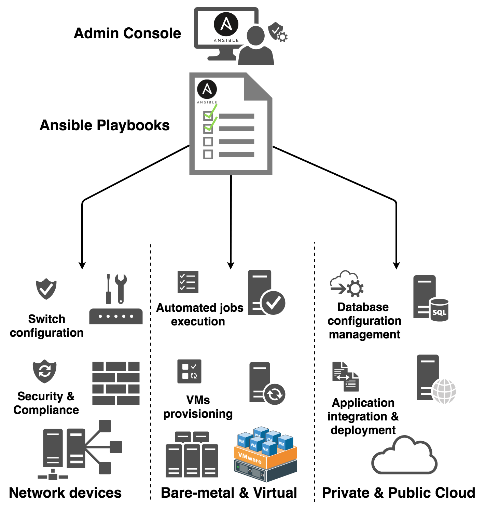

## What is infrastructure as code?

IaC is the managing and provisioning of instrastructure through code instead of manual processes.

IaC has many benefits for businesses including to reduce cost through saving time and resources, eliminate configuration drift and ensure provisioning of stable & scalable environments.

## Why ansible?

Ansible allows users to quickly and easily deploy multi-tier architecture.

Ansible is agentless and only needs to be installed on the controller (or master node); The systems being controlled do not need to have ansible installed.



## **Section 1**: Provision and upgrade VMs using Vagrant

In this guide, three virtual machines are configured through vagrant containing the provisions for a controller, web application and database with the following network configuration.

***controller***: 192.168.33.12

***web***: 192.168.33.10

***db***: 192.168.33.11

> Note: The vagrant file will contain the configuration for the controller, app and db. For this example, ubuntu 18.04 is the OS.

**Step 1**: Run the virtual machine and check that all three virtual machines are running.

```bash
vagrant up

vagrant status
```


**Step 2**: Access each of the virtual machines through SSH and update & upgrade the APT packages.

```bash
vagrant ssh <vm>

sudo apt-get update -y && sudo apt-get upgrade -y

exit
```

**Step 3**: SSH back into the controller and establish its connection to the two virtual machines through ssh, the user will be prompted with a password. 

> Note: Remember to be in the controller before establishing the connection. The password to access these VMs is vagrant.

```bash
ssh vagrant@<vm-ip-address>

exit
```

**Step 4**: Return back to the controller and install ansible.

```bash
sudo apt update -y && sudo apt upgrade -y

sudo apt install software-properties-common

sudo apt-add-repository ppa:ansible/ansible

sudo apt-get update -y

sudo apt install ansible

ansible --version
```

**Step 5**: New configuration files are now available to provision ansible and the controller to the two virtual machines; display the newly created directories and switch to the ansible directory.

```bash
sudo apt install tree

tree

cd /etc/ansible
```


**Step 6**: Access the `hosts` file and provide the required information to access the virtual machines.

```bash
sudo nano hosts
```


**Step 7**: Check to see the connections have been established. `Ping` looks for all the hosts in the agent nodes, inside the posts file and if any found, a ping request is sent.

```bash
sudo ansible all -m ping
```

