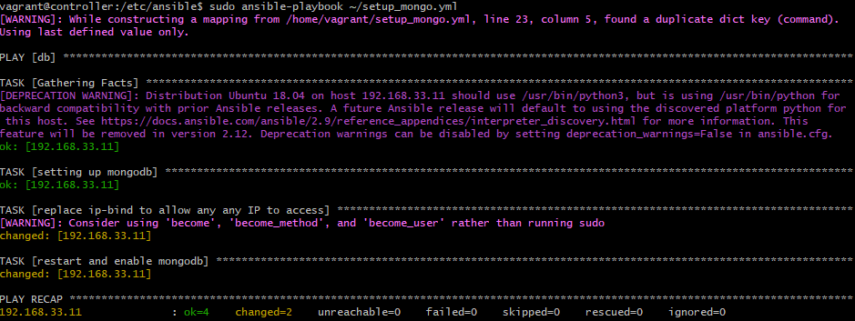
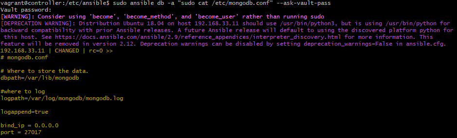
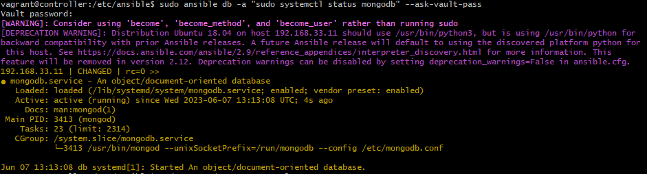
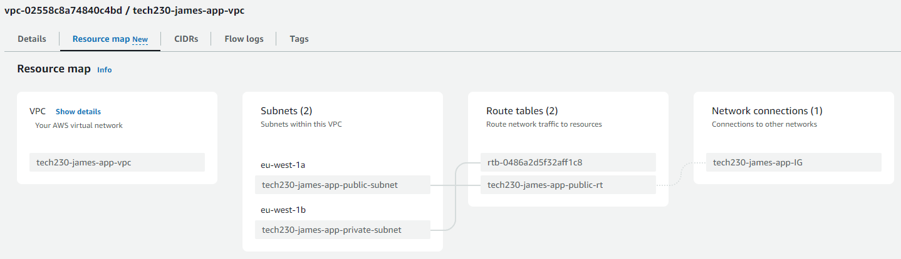
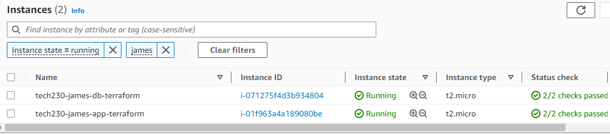
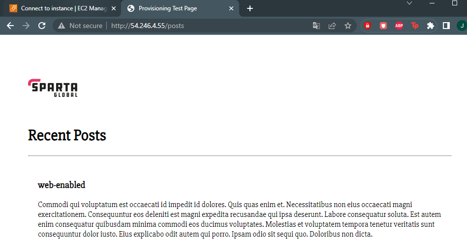

## What is Infrastructure as Code (IaC)?

Infrastructure as Code (or IaC) is the managing and provisioning of instrastructure through code instead of manual processes.

IaC has many benefits for businesses including to reduce cost through saving time and resources, eliminate configuration drift and ensure provisioning of stable & scalable environments.

## Why Ansible?

Ansible allows users to quickly and easily deploy multi-tier architecture.

Ansible is agentless and only needs to be installed on the controller (or master node); The systems being controlled do not need to have ansible installed.


## **Section 1**: Using Vagrant to configure an Ansible architecture

In this guide, three virtual machines are configured through vagrant containing the provisions for a controller, web application and database with the following network configuration.

A prerequisite to this guide is to have the application and associated database folder within the same directory as the vagrant file. Ensure to also sync these files so they appear within the controller once vagrant is run.

***controller***: 192.168.33.12

***web***: 192.168.33.10

***db***: 192.168.33.11

> Note: The vagrant file will contain the configuration for the controller, app and db. For this example, ubuntu 18.04 is the OS.

**Step 1**: Run the virtual machine and check that all three virtual machines are running.

```bash
vagrant up

vagrant status
```


**Step 2**: Access each of the virtual machines through SSH and update & upgrade the APT packages.

```bash
vagrant ssh <vm>

sudo apt-get update -y && sudo apt-get upgrade -y

exit
```

**Step 3**: SSH back into the controller and establish its connection to the two virtual machines through ssh, the user will be prompted with a password. 

> Note: Remember to be in the controller before establishing the connection. The password to access these VMs is vagrant.

```bash
ssh vagrant@<vm-ip-address>

exit
```

**Step 4**: Return back to the controller and install ansible.

```bash
sudo apt update -y && sudo apt upgrade -y

sudo apt install software-properties-common

sudo apt-add-repository ppa:ansible/ansible

sudo apt-get update -y

sudo apt install ansible

ansible --version
```

**Step 5**: New configuration files are now available to provision ansible and the controller to the two virtual machines; display the newly created directories and switch to the ansible directory.

```bash
sudo apt install tree

tree

cd /etc/ansible
```


**Step 6**: Access the `hosts` file and provide the required information to access the virtual machines.

```bash
sudo nano hosts
```


**Step 7**: Check to see the connections have been established. `Ping` looks for all the hosts in the agent nodes, inside the posts file and if any found, a ping request is sent.

```bash
sudo ansible all -m ping
```


## **Section 2**: Using Ansible to deploy a running web application

A prerequisite reminder for this section is to have the application folder present in the controller user directory. If not, ensure the file is present in the local vagrant directory and that the vagrant file contains the sync_file command to transfer it to the VM; proceed to destroy and start vagrant again.

**Step 8**: YAML defines its provisioning script as a playbook, containing a set of tasks to be executed. Create this file within the `/etc/ansible` directory.

```bash
sudo nano <playbook-name>.yml
```

**Step 9**: The following sudo code and commands.

```yaml
# create a playbook to install the applications dependencies and run

# add the 3 dashes --- to start the YAML file

---

# add the name of the host
- hosts: web

# gather additional facts about the steps
  gather_facts: yes

# add admins access to this file
  become: true

# add instructions to install + enable nginx - ensure status is running
  tasks:
  - name: Installing Nginx
    apt: pkg=nginx state=present

# add app folder to the web VM
  - name: Transfer app folder to web
    become: true
    synchronize:
      src: ~/app
      dest: /home/vagrant

# add instructions to install nodejs
  - name: Installing nodejs
    apt: pkg=nodejs state=present

# kill all nodejs processes before starting
  - name: Kill all node processes
    shell: killall node
    args:
      chdir: /home/vagrant/app/app

# add instructions to install npm
  - name: Installing npm
    shell: npm install
    args:
      chdir: /home/vagrant/app/app

# start app
  - name: Start the app
    shell: npm start
    args:
      chdir: /home/vagrant/app/app
```

**Step 10**: Execute the playbook to install the app dependencies and run the app. Check the app is running on the web browser.

```bash
sudo ansible-playbook <playbook-name>.yml
```


## **Section 3**: Using Ansible to configure the database

**Step 11**: Create a new YAML file in the `/etc/ansible/` directory.

```bash
cd /etc/ansible/

sudo nano setup_mongodb.yml
```

**Step 12**: Provide the following YAML commands into the file.

```bash
# installing required version of mongodb in db-server
# hosts entries are already done - ssh/password authentication in place

---

# hosts name
- hosts: db

# get facts/logs
  gather_facts: yes

# admin access
  become: True

# add instructions
  tasks:

    # install and run mongodb
  - name: setting up mongodb
    apt: pkg=mongodb state=present

    # amend the mongodb config file
  - name: replace ip-bind to allow any any IP to access
    command: sudo sed -i 's+127.0.0.1+0.0.0.0+' /etc/mongodb.conf
    command: sudo sed -i 's+#port = 27017+port = 27017+' /etc/mongodb.conf

    # restart and enable mongodb
  - name: restart and enable mongodb
    ansible.builtin.service:
      name: mongodb
      state: restarted
      enabled: yes
```

**Step 13**: Run the file and ensure ansible successfully completes all the tasks.

```bash
sudo ansible-playbook setup_mongo.yml
```



**Step 14**: Check that the `mongodb.conf` file has been amended and mongodb is running.

```bash
sudo ansible db -a "sudo cat /etc/mongodb.conf" --ask-vault-pass

sudo ansible db -a "sudo systemctl status mongodb" --ask-vault-pass
```





## **Section 4**: Using Terraform to deploy an EC2 instance

A prerequisite to this task is to first the correct binary file of Terraform through ther [hashicorp website](https://developer.hashicorp.com/terraform/downloads). Ensure the file is made available through firstly moving it to an appropriate programs folder within your hardrive, then executing the file with administator permissions. Follow this up by the file is available on PATH as an environment variable.

**Step 15**: Create a new directory for terraform; initialise terraform and create a new file.

```bash
terraform init

sudo nano main.tf
```

**Step 16**: Assign the service to the file as AWS.

```terraform
provider "aws" {
	region = "eu-west-1"
}
```

**Step 17**: Configure the EC2 instance as required.

```terraform
resource "aws_instance" "app_instance"{

	ami = "ami-00e8ddf087865b27f"
	instance_type = "t2.micro"
	associate_public_ip_address = true

	tags = {
		Name = "james-tech230-terraform-app"
	}
}
```

## **Section 5**: Using Terraform deploy a two tier architecture within a VPC.

**Step 18**: Create a VPC using the default CIDR block.

```terraform
resource "aws_vpc" "main" {
 cidr_block = "10.0.0.0/16"
 
 tags = {
   Name = "tech230-james-app-vpc"
 }
}
```

**Step 19**: Configure the public and private subnet with different CIDR blocks and AZ.

```terraform
resource "aws_subnet" "public_subnet" {
 vpc_id            = aws_vpc.main.id
 cidr_block        = "10.0.2.0/24"
 availability_zone = "eu-west-1a"
 
 tags = {
   Name = "tech230-james-app-public-subnet"
 }
}
 
resource "aws_subnet" "private_subnet" {
 vpc_id            = aws_vpc.main.id
 cidr_block        = "10.0.3.0/24"
 availability_zone = "eu-west-1b"
 
 tags = {
   Name = "tech230-james-app-private-subnet"
 }
}
```

**Step 20**: Create the internet gateway (IG) and associate it to the VPC.

```terraform
resource "aws_internet_gateway" "gw" {
 vpc_id = aws_vpc.main.id
 tags = {
   Name = "tech230-james-app-IG"
 }
}
```

**Step 21**: Create a second route table for the public subnet and link the association.

```terraform
# create second route table for public subnet

resource "aws_route_table" "second_rt" {
 vpc_id = aws_vpc.main.id
 
 route {
   cidr_block = "0.0.0.0/0"
   gateway_id = aws_internet_gateway.gw.id
 }
 
 tags = {
   Name = "tech230-james-app-public-rt"
 }
}

resource "aws_route_table_association" "public_subnet_asso" {
 subnet_id      = aws_subnet.public_subnet.id
 route_table_id = aws_route_table.second_rt.id
}
```



**Step 22**: Configure the security groups for the public and private subnets; remember to link this to the VPC.

```terraform
# Deploy Public Subnet Security Group

resource "aws_security_group" "public_subnet_sg" {
	name        = "public_subnet_sg"
	description = "Allow Port 80 (HTTP), 22 (SSH) and 3000 (NodeJS)"
	vpc_id      = aws_vpc.main.id

	ingress {
		from_port   = 80
		to_port     = 80
		protocol    = "tcp"
		cidr_blocks = ["0.0.0.0/0"]
	}
	ingress {
		from_port   = 22
		to_port     = 22
		protocol    = "tcp"
		cidr_blocks = ["0.0.0.0/0"]
	}
	ingress {
		from_port   = 3000
		to_port     = 3000
		protocol    = "tcp"
		cidr_blocks = ["0.0.0.0/0"]
	}
	egress {
		from_port   = 0
		to_port     = 0
		protocol    = "-1"
		cidr_blocks = ["0.0.0.0/0"]
	}
}

# Deploy Private Subnet Security Group

resource "aws_security_group" "private_subnet_sg" {
	name        = "private_subnet_sg"
	description = "Allow 27017 (MongoDB)"
	vpc_id      = aws_vpc.main.id

	ingress {
		from_port   = 27017
		to_port     = 27017
		protocol    = "tcp"
		cidr_blocks = ["10.0.0.0/16"]
	}
	egress {
		from_port   = 0
		to_port     = 0
		protocol    = "-1"
		cidr_blocks = ["0.0.0.0/0"]
	}
}
```

**Step 23**: Deploy the two EC2 instances containing the AMI for the app and database as well as the dependencies within the userdata.

```terraform
# Deploy EC2 Instance for Database in Private Subnet

resource "aws_instance" "db_instance" {
  ami                         = "ami-06c5f4ed7a203bed8"
  instance_type               = "t2.micro"
  key_name					  = "tech230"
  availability_zone           = "eu-west-1b"
  vpc_security_group_ids      = [aws_security_group.private_subnet_sg.id]
  subnet_id                   = aws_subnet.private_subnet.id
  private_ip 				  = "10.0.3.122"
  associate_public_ip_address = true

  tags = {
    Name = "tech230-james-db-terraform"
  }
}

# Deploy EC2 Instance for Web Application in Public Subnet

resource "aws_instance" "app_instance" {
  ami                         = "ami-0136ddddd07f0584f"
  instance_type               = "t2.micro"
  key_name					  = "tech230"
  availability_zone           = "eu-west-1a"
  vpc_security_group_ids      = [aws_security_group.public_subnet_sg.id]
  subnet_id                   = aws_subnet.public_subnet.id
  associate_public_ip_address = true
  depends_on 		  = [aws_instance.db_instance]
  user_data                   = <<-EOF
        #!/bin/bash
        # Update the sources list and Upgrade any available packages
        sudo apt update -y && sudo apt upgrade -y

        # gets sources list that could potentially be needed for the following installations
        sudo apt update

        # Installs Nginx
        sudo apt install nginx -y

        # Installs git
        sudo apt install git -y

        # sets source to retrieve nodejs
        curl -sL https://deb.nodesource.com/setup_12.x | sudo -E bash -

        # installs node.js
        sudo apt install -y nodejs

        # Enables Nginx to run on start up of API or VM
        sudo systemctl enable nginx

        #echo "export DB_HOST=mongodb://10.0.3.122:27017/posts" >> ~/.bashrc
        #source ~/.bashrc
        export DB_HOST=mongodb://10.0.3.122:27017/posts

        # clone repo with app folder into folder called 'repo'
        git clone https://github.com/daraymonsta/CloudComputingWithAWS repo

        # install the app (must be after db vm is finished provisioning)
        cd repo/app
        npm install

        # seed database
        echo "Clearing and seeding database..."
        node seeds/seed.js
        echo "  --> Done!"

        # start the app (could also use 'npm start')

        # using pm2

        # install pm2

        sudo npm install pm2 -g

        # kill previous app background processes

        pm2 kill

        # start the app in the background with pm2

        pm2 start app.js
        EOF

  tags = {
    Name = "tech230-james-app-terraform"
  }
}
```





**Step 24**: When finished, destroy terraform and all of the services that have been initialised.

```terraform
terraform destroy
```